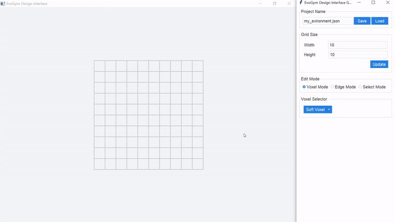

# evogym-design-tool
Design tool for creating Evolution Gym environments as seen in [Evolution Gym: A Large-Scale Benchmark for Evolving Soft Robots](https://evolutiongym.github.io/) (**NeurIPS 2021**).




## Installation
Please use the installation instructions for the main repo [here](https://github.com/EvolutionGym/evogym). You can use the same environment for the design tool.

## Run the Code

To launch the tool, run

```
python src/main.py
```

## Controls

- **Left Click**: Add/remove voxels and edges or select objects. Action is dependent on the **Edit Mode** selected in the gui
- **Right Click and Drag**: Pan the camera
-  **Mouse Wheel**: Zoom in/out

## Exporting and Importing

All files are saved and read from `exported/`.

## Known Issues

We are working on fixes!

* Black screen -- python with `tkinter` version `8.5`. Try [upgrading](https://stackoverflow.com/questions/65910347/python-not-using-tkinter-8-6-installed-with-homebrew-on-mac) to `8.6`.
* Offset grid -- issue on macOS.
